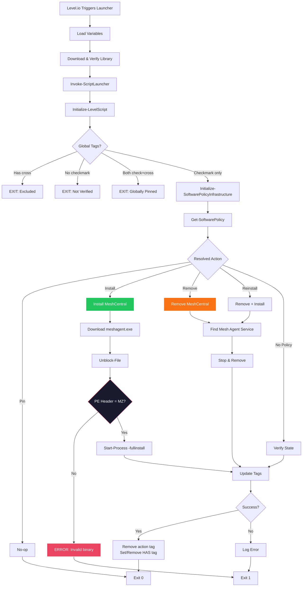
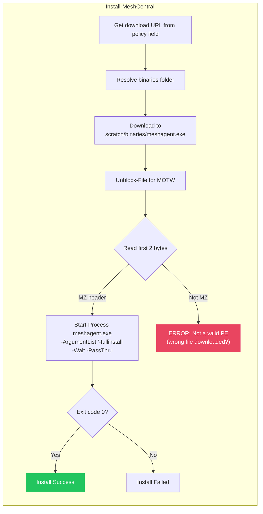

# MeshCentral Policy

Software policy enforcement for MeshCentral remote management agent.

## Flow

### Installation Detail

## Overview

Manages MeshCentral agent installation and removal based on tag and custom field policies. The agent installer is downloaded as an `.exe` from the MeshCentral server and run with `-fullinstall`.

## Policy Field

`policy_meshcentral` — Set to `install`, `remove`, `pin`, or leave as default for tag-based control.

## Additional Fields

| Field | Description |
|-------|-------------|
| `policy_meshcentral_server_url` | MeshCentral server URL |
| `policy_meshcentral_download_url` | Windows agent download URL (must point to `.exe`) |
| `policy_meshcentral_linux_install` | Linux installation command |
| `policy_meshcentral_mac_download_url` | macOS agent download URL |

## Tags

| Tag | Action | Persists |
|-----|--------|----------|
| `MESHCENTRAL` (Install) | Install MeshCentral if missing | No — removed after action |
| `MESHCENTRAL` (Remove) | Remove MeshCentral if present | No — removed after action |
| `MESHCENTRAL` (Pin) | Lock current state — no changes | Yes — admin intent |
| `MESHCENTRAL` (Reinstall) | Remove then reinstall | No — removed after action |
| `MESHCENTRAL` (Has) | Status: currently installed | Yes — set/cleared by script |

## Installation Notes

- **Installer format:** `.exe` only (not `.msh`). The download URL in `policy_meshcentral_download_url` must point to an executable.
- **PE validation:** Before running, the script reads the first 2 bytes and verifies the `MZ` header. If the file isn't a valid PE, the install is aborted with an error.
- **Unblock-File:** Applied after download to remove Mark of the Web, preventing "operation not supported" errors when running as SYSTEM via Level.io.
- **Binaries folder:** Installer is saved to `scratch/binaries/meshagent.exe` via `Get-BinariesFolder`, shared across runs.
- **Install method:** `Start-Process -FilePath meshagent.exe -ArgumentList "-fullinstall" -Wait -PassThru`

## Platforms

- Windows (PowerShell launcher)
- Linux (Bash launcher)
- macOS (Bash launcher)

## Related

- [Policy System](README.md)
- [Tag System](TAGS.md)
- [Policy Fields Reference](../POLICY-FIELDS.md)
