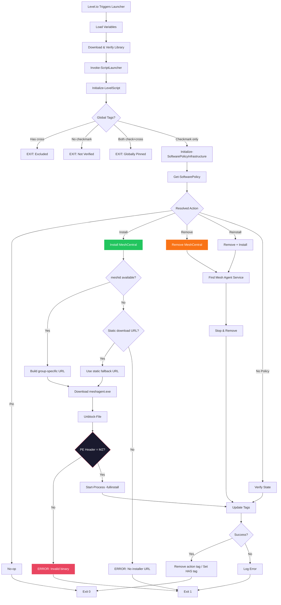

# MeshCentral Policy

Software policy enforcement for MeshCentral remote management agent. Group-aware: each Level.io group gets its own MeshCentral device group and meshid, so devices auto-install into the correct group.

## Architecture

```
tools/provision-mesh-groups.js
  ├── Reads all Level.io groups (GET /v2/groups)
  ├── Creates matching MeshCentral device group (via vendor/meshctrl.js)
  └── Writes meshid back to Level.io group (PATCH /v2/groups/<id>)
        └── policy_meshcentral_meshid = "<meshid>"  (per-group override)

Level.io custom field cascade:
  Group: policy_meshcentral_meshid = "abc123..."
    └── Device inherits meshid via {{cf_policy_meshcentral_meshid}}
          └── Script builds installer URL:
                https://<server>/meshagents?id=<arch>&meshid=<meshid>&installflags=0
```

## Flow


```mermaid
flowchart TD
    A[Level.io Triggers Launcher] --> B[Load Variables]
    B --> C[Download & Verify Library]
    C --> D[Invoke-ScriptLauncher]
    D --> E[Initialize-LevelScript]

    E --> F{Global Tags?}
    F -->|"Has cross"| Z1[EXIT: Excluded]
    F -->|"No checkmark"| Z2[EXIT: Not Verified]
    F -->|"Both check+cross"| Z3[EXIT: Globally Pinned]
    F -->|"Checkmark only"| G

    G[Initialize-SoftwarePolicyInfrastructure] --> H[Get-SoftwarePolicy]

    H --> I{Resolved Action}
    I -->|Pin| J1[No-op]
    I -->|Install| J2[Install MeshCentral]
    I -->|Remove| J3[Remove MeshCentral]
    I -->|Reinstall| J4[Remove + Install]
    I -->|No Policy| J5[Verify State]

    J2 --> K{meshid available?}
    K -->|Yes| K1[Build group-specific URL]
    K -->|No| K2{Static download URL?}
    K2 -->|Yes| K3[Use static fallback URL]
    K2 -->|No| K4[ERROR: No installer URL]
    K1 --> K5[Download meshagent.exe]
    K3 --> K5
    K5 --> K6[Unblock-File]
    K6 --> K7{PE Header = MZ?}
    K7 -->|No| K8[ERROR: Invalid binary]
    K7 -->|Yes| K9["Start-Process -fullinstall"]
    K9 --> L

    J3 --> M[Find Mesh Agent Service]
    M --> M1[Stop & Remove]
    M1 --> L

    J4 --> M
    J5 --> L

    L[Update Tags] --> N{Success?}
    N -->|Yes| N1["Remove action tag / Set HAS tag"]
    N -->|No| N2[Log Error]
    N1 --> O[Exit 0]
    N2 --> P[Exit 1]
    J1 --> O
    K4 --> P
    K8 --> P

    style K7 fill:#1a1a2e,stroke:#e94560,color:#fff
    style K8 fill:#e94560,stroke:#fff,color:#fff
    style J2 fill:#22c55e,stroke:#fff,color:#fff
    style J3 fill:#f97316,stroke:#fff,color:#fff
```

## Policy Field

`policy_meshcentral` — Set to `install`, `remove`, `pin`, or leave empty for tag-based control.

## Custom Fields

| Field | Scope | Description |
|-------|-------|-------------|
| `policy_meshcentral` | Global/Group | Policy action (install/remove/pin) |
| `policy_meshcentral_server_url` | Global | MeshCentral server URL (e.g., `mc.cool.net.au`) |
| `policy_meshcentral_meshid` | **Per-group** | MeshCentral device group ID, provisioned by `provision-mesh-groups.js` |
| `policy_meshcentral_download_url` | Global | Static fallback Windows installer URL (used when no meshid) |
| `policy_meshcentral_linux_install` | Global | Linux installation command (one-liner) |
| `policy_meshcentral_linux_meshid` | Per-group | Linux-specific meshid (if different from Windows) |
| `policy_meshcentral_mac_download_url` | Global | macOS agent download URL |

## Installer URL Resolution

The Windows script resolves the download URL in priority order:

1. **Group-specific URL** (preferred): Built from `policy_meshcentral_meshid` — `https://<server>/meshagents?id=<arch>&meshid=<meshid>&installflags=0`
2. **Static fallback**: `policy_meshcentral_download_url` — used when meshid is not set for this group

If neither is available, installation fails with an error directing the admin to run `provision-mesh-groups.js`.

## Group Provisioning

Run `tools/provision-mesh-groups.js` whenever a new Level.io group is created:

```bash
node tools/provision-mesh-groups.js           # live run
node tools/provision-mesh-groups.js --dry-run  # preview only
```

The script:
1. Fetches all Level.io groups via `GET /v2/groups`
2. For each group, creates a MeshCentral device group (via `vendor/meshctrl.js`) if one doesn't already exist
3. Writes the meshid back to Level.io via `PATCH /v2/groups/<group_id>` with body `{ "custom_fields": { "policy_meshcentral_meshid": "<meshid>" } }`

**Important**: Group field writes must use `PATCH /v2/groups/<id>`, not `PATCH /v2/custom_field_values` — the latter silently drops group-level values. See [LEVEL-API-GROUP-FIELDS-FINDINGS.md](../LEVEL-API-GROUP-FIELDS-FINDINGS.md).

## Tags

| Tag | Action | Persists |
|-----|--------|----------|
| U+1F64F MESHCENTRAL (Install) | Install MeshCentral if missing | No — removed after action |
| U+1F6AB MESHCENTRAL (Remove) | Remove MeshCentral if present | No — removed after action |
| U+1F4CC MESHCENTRAL (Pin) | Lock current state — no changes | Yes — admin intent |
| U+1F504 MESHCENTRAL (Reinstall) | Remove then reinstall | No — removed after action |
| U+2705 MESHCENTRAL (Has) | Status: currently installed | Yes — set/cleared by script |

## Installation Notes

- **Installer format:** `.exe` only (not `.msh`). The download URL must point to an executable.
- **PE validation:** Before running, the script reads the first 2 bytes and verifies the `MZ` header. If the file isn't a valid PE, the install is aborted.
- **Unblock-File:** Applied after download to remove Mark of the Web, preventing "operation not supported" errors when running as SYSTEM via Level.io.
- **Binaries folder:** Installer is saved to `scratch/binaries/meshagent.exe` via `Get-BinariesFolder`, shared across runs.
- **Install method:** `Start-Process meshagent.exe -ArgumentList "-fullinstall" -Wait -PassThru`

## Platforms

| Platform | Script | Meshid Field |
|----------|--------|-------------|
| Windows | `scripts/Policy/👀meshcentral.ps1` | `{{cf_policy_meshcentral_meshid}}` |
| Linux | `scripts/Policy/👀meshcentral-linux.sh` | `{{cf_policy_meshcentral_meshid}}` + `{{cf_policy_meshcentral_linux_meshid}}` |
| macOS | `scripts/Policy/👀meshcentral-mac.sh` | `{{cf_policy_meshcentral_mac_download_url}}` |

Linux and macOS scripts are bash-based and run directly from Level.io launchers (not via the PowerShell launcher system).

## Related

- [Policy System](README.md)
- [Tag System](TAGS.md)
- [Policy Fields Reference](../POLICY-FIELDS.md)
- [Level.io Group Field Findings](../LEVEL-API-GROUP-FIELDS-FINDINGS.md)
