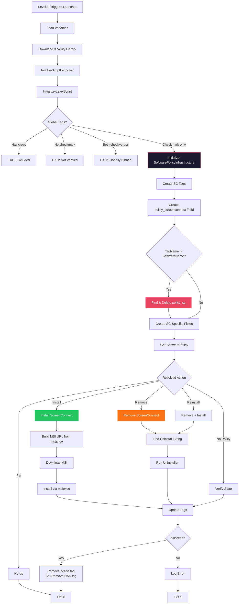
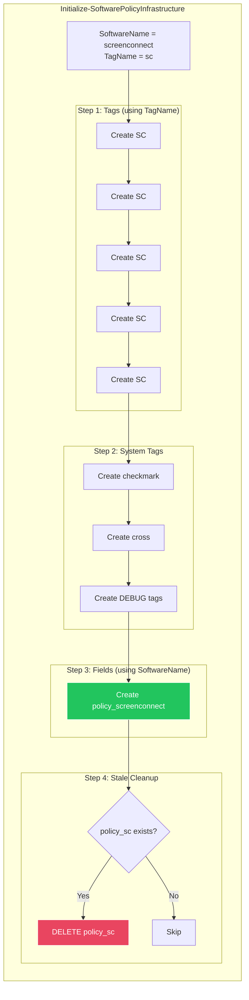

# ScreenConnect Policy

Software policy enforcement for ConnectWise ScreenConnect (Control) remote access agent.

## Naming Convention

ScreenConnect uses a **split naming** model — this is the only script where tag names differ from field names:

| Aspect | Name | Example |
|--------|------|---------|
| **Tags** | `SC` (short) | `SC`, `SC`, `SC`, `SC`, `SC` |
| **Fields** | `screenconnect` (full) | `policy_screenconnect`, `policy_screenconnect_instance_id`, etc. |

This is handled by passing both `-SoftwareName "screenconnect"` and `-TagName "sc"` to `Initialize-SoftwarePolicyInfrastructure`. The function:
1. Creates tags using `TagName` (uppercased) → `SC`, `SC`, etc.
2. Creates the policy field using `SoftwareName` → `policy_screenconnect`
3. Auto-deletes the stale `policy_sc` field if it exists from older code

## Flow



### Infrastructure Bootstrap Detail



## Overview

Manages ScreenConnect agent installation and removal based on tag and custom field policies. Uses the 5-tag model (Install, Remove, Pin, Reinstall, Has) with `SC` as the tag suffix, while all custom fields use the full `screenconnect` name.

## Policy Field

`policy_screenconnect` — Set to `install`, `remove`, `pin`, or leave as default for tag-based control.

> **Note:** Older versions of this script incorrectly created a `policy_sc` field. The current version auto-detects and removes this stale field on first run.

## Additional Fields

| Field | Description |
|-------|-------------|
| `policy_screenconnect_instance_id` | ScreenConnect instance ID (GUID). Used for whitelisting and to derive the service display name: `ScreenConnect Client (<id>)` |
| `policy_screenconnect_api_user` | API username for device URL lookup |
| `policy_screenconnect_api_password` | API password |
| `policy_screenconnect_device_url` | Device-specific ScreenConnect URL (auto-populated) |
| `policy_screenconnect_baseurl` | Base URL for ScreenConnect server |

## Tags

| Tag | Action | Persists |
|-----|--------|----------|
| `SC` (Install) | Install ScreenConnect if missing | No — removed after action |
| `SC` (Remove) | Remove ScreenConnect if present | No — removed after action |
| `SC` (Pin) | Lock current state — no changes | Yes — admin intent |
| `SC` (Reinstall) | Remove then reinstall | No — removed after action |
| `SC` (Has) | Status: currently installed | Yes — set/cleared by script |

## Script Variables

```
$SoftwareName  = "screenconnect"   # Used for field names
$TagName       = "sc"              # Used for tag names (short form)
$ScriptVersion = "2026.01.31.01"   # Bumped for launcher cache invalidation
```

## Related Scripts

- [Extract and Set ScreenConnect Device URL](../scripts/ScreenConnect-Device-URL.md)
- [Force Remove Non-MSP ScreenConnect](../scripts/Force-Remove-Non-MSP-ScreenConnect.md)

## Related

- [Policy System](README.md)
- [Tag System](TAGS.md)
- [Policy Fields Reference](../POLICY-FIELDS.md)
